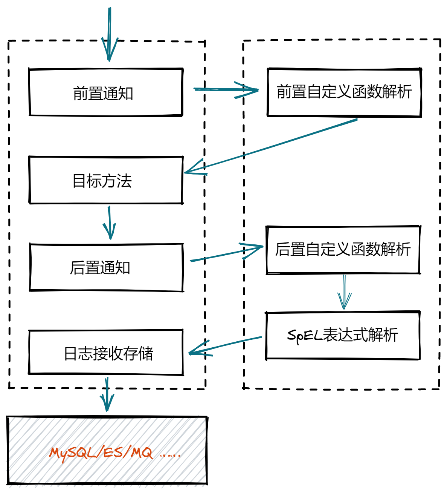

```text
                        _             
                       | |            
  ___  __ _ ___ _   _  | | ___   __ _ 
 / _ \/ _` / __| | | | | |/ _ \ / _` |
|  __/ (_| \__ \ |_| | | | (_) | (_| |
 \___|\__,_|___/\__, | |_|\___/ \__, |
                 __/ |           __/ |
                |___/           |___/ 

```

   

- GitHub: [https://github.com/flyhero/easy-log](https://github.com/flyhero/easy-log)
- Gitee: [https://gitee.com/flyhero/easy-log](https://gitee.com/flyhero/easy-log)

## 1. 项目简介
easy-log是基于SpringBoot的一款通用操作日志组件，它指在帮助我们通过注解优雅地聚合项目中的操作日志，对业务代码无侵入。

## 2. 使用场景
所有系统都会有日志，但我们区分了 **系统日志** 和 **操作日志**

- 系统日志：主要用于开发者调试排查系统问题的，不要求固定格式和可读性
- 操作日志：主要面向用户的，要求简单易懂，反应出用户所做的动作。

通过操作日志可追溯到 某人在某时干了某事情，如：

| 租户  | 操作人 | 时间               | 操作 | 内容                           |
| ----- | ------ | ------------------ | ---- | ------------------------------ |
| A租户 | 小明   | 2022/2/27 20:15:00 | 新增 | 新增了一个用户：Mr.Wang        |
| B租户 | 大米   | 2022/2/28 10:35:00 | 更新 | 修改订单 [xxxxxx] 价格为 xx 元 |
| C租户 | 老王   | 2022/2/28 22:55:00 | 查询 | 查询了名为: [xx] 的所有交易    |


## 3. 功能特性
 - 快速接入：基于SpringBoot，轻量级，引入starter即可食用
 - SpEL解析：直接写表达式解析入参
 - 自定义函数：支持目标方法执行前/后的自定义函数

## 4. 设计图



## 5. 使用方法
### 5.1 引入依赖

已上传到中央仓库：https://search.maven.org/search?q=g:io.github.flyhero

在pom.xml中引入：
```
<dependency>
    <groupId>io.github.flyhero</groupId>
    <artifactId>easylog-spring-boot-starter</artifactId>
    <version>2.1.1</version>
</dependency>
```
### 5.2 配置

```properties
# 默认开启可不填，禁用是填 false
easylog.enable=true
# 当有多个服务用时，用于区分不同服务下的操作日志，默认取 spring.application.name
easylog.platform=easylog-example
# 是否在控制台打印 banner,默认打印
easylog.banner=false
```

### 5.3 使用注解
在要记录操作日志的方法上添加EasyLog注解并填写对应内容：

```java
@EasyLog(module = "用户模块", operator = "{{#userDto.toString()}}", type = "新增",
        success = "测试 {functionName{#userDto.name}}",
        condition = "{{#userDto.name == 'easylog'}}")
public String test(UserDto userDto) {
    return "test";
}
```
| 字段        | 意义                            | 支持SpEl表达式 | 必填 |
| ----------- | ------------------------------- | ---------- | ---- |
| tenant      | 租户，SAAS系统中区分不同租户    | 是         | 否   |
| operator    | 操作者                          | 是         | 否   |
| module      | 模块，区分不同业务模块          | 否         | 否   |
| type | 操作类型，形如：增删改查        | 否         | 否   |
| bizNo       | 业务编号，便于查询   | 是         | 否   |
| success     | 成功日志模板内容                  | 是         | 是   |
| fail        | 操作失败时的模板内容            | 是         | 否   |
| detail      | 额外的记录信息                  | 是         | 否   |
| condition   | 是否记录的条件 (默认:true 记录) | 是         | 否   |

> 注意: 
> 
> 1.当使用自定义函数时，必须使用双花括号包起来（如：{getNameById{#id}} ），便于解析。
> 
> 2.当不使用自定义函数时，可以直接使用SpEl表达式（如：#name）
> 如果获取方法的执行结果或错误信息，可使用{{#_result}}或#_result 和 {{#_errMsg}}或#_errMsg。

### 5.4 获取操作者
如果不在上述注解中指定租户和操作人，那么可统一设置，方式如下：
实现 **IOperatorService** 接口，并交给Spring管理。
```java
@Service
public class OperatorGetService implements IOperatorService {
    @Override
    public String getOperator() {
        //可从请求头中获取token解析用户
        HttpServletRequest request = ((ServletRequestAttributes) RequestContextHolder.getRequestAttributes()).getRequest();
        String token = request.getHeader("token");
        return "admin";
    }
    @Override
    public String getTenant() {
        return "company";
    }
}
```

### 5.5 自定义函数
当方法参数中，没有你想要的数据时，我们可以通过自定义函数来实现。
实现 **ICustomFunction** 接口，并交给Spring管理。
```java
@Component
public class GetRealNameById implements ICustomFunction {
    @Override
    public boolean executeBefore() {
        return false;
    }
    @Override
    public String functionName() {
        return "GetRealNameById";
    }
    @Override
    public String apply(String value) {
        return "easylog".equals(value) ? "good" : value;
    }
}
```

### 5.6 接收操作日志
我们接收到操作日志后，可根据实际情况来选择如何处理，是存储到数据库还是发送到MQ都可以。
实现 **ILogRecordService** 接口，并交给Spring管理。
```java
@Slf4j
@Service
public class OpLogRecordService implements ILogRecordService {
    @Override
    public void record(EasyLogInfo easyLogInfo) {
        log.info("hello easy-log:{}", JsonUtils.toJSONString(easyLogInfo));
    }
}
```

## QA
### 1、同一类中互相调用含 @Easylog 注解的方法，只有一条日志
这是因为 Spring AOP 无法拦截内部方法调用。解决方案：

1、修改，不要出现“自调用”的情况，这是Spring文档中推荐的“最佳”方案；

2、若一定要自调用，那么在 SpringBoot 启动类中加一个注解：
```java
@EnableAspectJAutoProxy(exposeProxy = true)
```
然后将自调用的方法, this.test2() 替换为：((当前类) AopContext.currentProxy()).test2();

### 2、EasyLog 注解中 许多方法返回的是 String，如何存储更多的信息？

可将String当作json字符串，比如 操作者 operator 是String类型，那么它可以存储以下字符串信息：
```text
{"id": 1, "name": "admin", "ip": "127.0.0.1"}
```

## Change Log

| 版本    | 内容                                      |状态 |
|-------|-----------------------------------------|----|
| 2.1.1 | 1.修复前置函数的返回值获取错误          | 推荐使用|
| 2.1.0 | 1.支持同一方法多个EasyLog注解  2.自定义函数参数支持Object类型 | 推荐使用|
| 2.0.0 | 增加配置，提升性能，不兼容低版本                        | 推荐使用|
| 1.0.1 | 基本型，性能欠佳                                | 不推荐|
| 1.0.0 | 基本型，有bug，性能欠佳                           | 不要使用|
